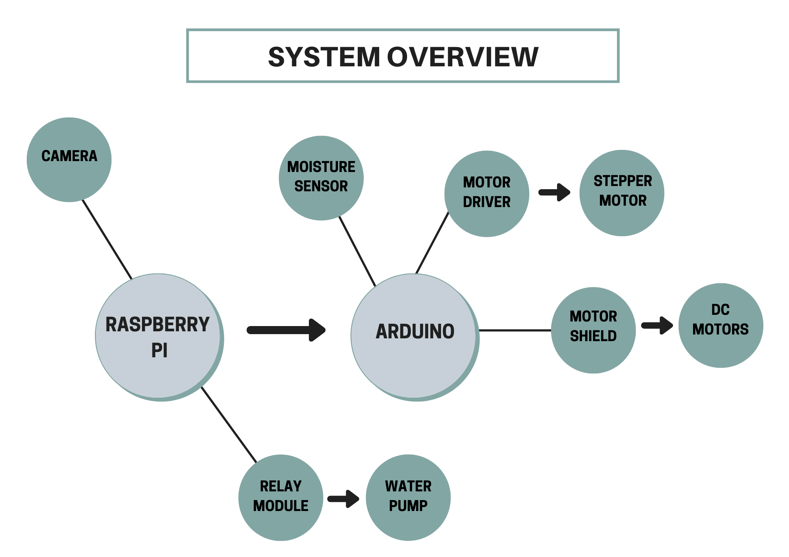
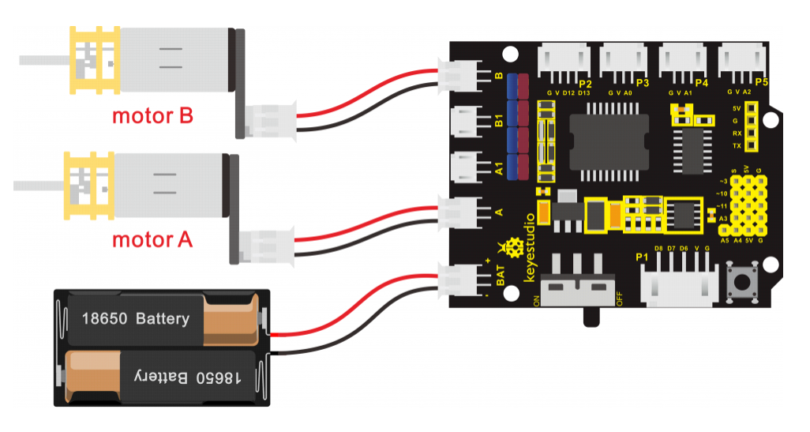

# 🚜 Smart Farming Rover – IoT-Enabled Agricultural Robot

**Platform**: Raspberry Pi + Arduino + Web Interface + Soil Moisture Sensor + Motor Control  
**Project Type**: Full-stack Embedded System with Real-Time Control and Simulation

---

## 🔍 Project Summary

This project is a **smart agricultural rover** designed to **autonomously detect soil moisture levels** and **activate a spraying mechanism** when required. It integrates a **web-based control interface**, real-time **sensor monitoring**, and **motorized actuation** using Raspberry Pi and Arduino.

Key goals of this system:
- Automate soil moisture sensing and irrigation.
- Enable real-time manual control through a browser GUI.
- Provide hands-on experience in **embedded programming**, **IoT integration**, **hardware simulation**, and **web development**.

---

## 🧠 Key Technologies & Skills Demonstrated

| Domain             | Tools & Concepts                                                   |
|--------------------|--------------------------------------------------------------------|
| Embedded Systems   | Arduino Uno, PWM control, DC motor control, stepper motor actuation|
| IoT Integration    | Serial communication (UART) between Raspberry Pi & Arduino         |
| Web Development    | Python, Bottle (micro web framework), HTML/CSS, AJAX               |
| Robotics Control   | H-Bridge (L298N), moisture sensor feedback loop, GPIO handling     |
| Sensor Simulation  | Tinkercad Circuits for prototyping moisture sensor + motor system  |
| Full-Stack Design  | End-to-end hardware + software system integration                  |
| UI/UX Design       | Browser GUI to control movement, monitor sensor, and spray         |

---

## 🖼️ GUI Interface

> Real-time control panel built with Bottle (Python) and HTML/CSS


- Move rover forward/backward/left/right
- Monitor soil moisture in real time
- Activate sprayer on dry soil

---

## ⚙️ System Architecture



### Components Overview

- **Arduino Uno**:
  - Reads analog data from the **soil moisture sensor**
  - Controls **DC motors** via L298N H-Bridge
  - Activates **spraying mechanism** using a stepper motor

- **Raspberry Pi**:
  - Hosts the **web server** using Python + Bottle
  - Sends user commands via **serial** to Arduino
  - Displays GUI to the user

- **Communication**: USB serial between Pi ↔ Arduino  
- **Simulation Tools**: Tinkercad Circuits for logic validation

---

## 🔌 Tinkercad Sensor Circuit

> Simulated environment for analog soil moisture sensor behavior


---

## 🔁 Tinkercad Motor Control Simulation

> Dual DC motor simulation using H-Bridge (L298N)



---


## 🚀 How to Run the Project

### 🔧 Hardware Setup

- Soil moisture sensor → Arduino A0  
- Motor driver (L298N) → Arduino PWM pins  
- Stepper motor (for spraying) → Digital pins  
- Arduino USB → Raspberry Pi

### 💻 Software Setup

1. Flash `rover_control.ino` to Arduino
2. On Raspberry Pi, run:
   ```bash
   python3 bottle2rover.py

3. Open browser at `http://<raspberrypi-ip>:8080`
4. Control rover + view sensor data in GUI

---

## 💡 Future Enhancements

* Add **autonomous navigation** using GPS or line tracking
* Integrate **machine learning** for crop moisture prediction
* Deploy remote telemetry using **MQTT** or **LoRa**
* Add **cloud-based dashboard** for farmers

---

## 🎯 Why This Project Stands Out

This project showcases **real-world problem solving** using a combination of hardware, software, and web technologies. It emphasizes:

* **Hardware/software integration**
* **Robust communication protocols**
* **Modular and scalable architecture**
* **Real-time interaction and control**
* **End-to-end IoT pipeline** from sensor to user interface


